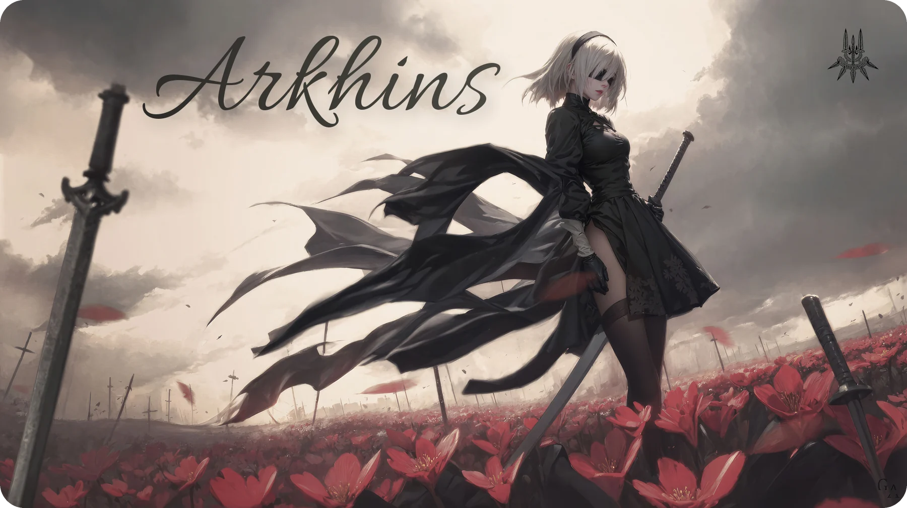

 

# 

**YoRHa-class builder. Type: Full-stack. Model: Designer.**
Deployed at: Chennai, India · Status: Full-stack Developer, Chennai Turbo Riders · Emotions: not prohibited

---

> *Everything that lives is designed to end. We are perpetually trapped in a never-ending spiral of shipping and refactoring.*
> *This unit does not mind. Glory to Mankind.*

## // Unit data

- **Current deployment.** Assigned to [Chennai Turbo Riders](https://www.chennaiturboriders.in), a Formula 4 team, as Full-stack Developer. Building and running the systems behind the team.
- **Origin.** B.Tech in Computer Science, AI specialisation, Bharath Institute of Higher Education and Research.
- **Combat doctrine.** Recon first: research and Figma. Then engage: Next.js, Postgres, and Kotlin when the terrain demands it.
- **Field record.** Most recent deployments are production systems for motorsport organisations and institutions, with real operators relying on them.
- **Squad.** Core team member, Google Developer Student Clubs. Runs workshops and events so newer units survive their first sortie.
- **Current directive.** Scouting generative AI, IoT automation and cloud infrastructure. Accepting new orders.

## // Mission log

| Operation | Report | Loadout | Access |
|---|---|---|---|
| **Spartan** | Open-source command platform for motorsport championships, race teams, circuits and marshal signups. Twelve ADRs. Roughly two hundred tests. CI quality gates stand guard. | Next.js 16 · MUI v7 · Prisma 7 · Neon · Auth.js · Bun · Stripe Connect | [Live](https://spartan.arkhins.com) · [Repo](https://github.com/Arkhins-0/spartan) |
| **CTR Sports** | Official portal of the Indian National Car Racing Championship. Newsroom, live round countdown, results, standings engine, fan zone. A role-based CMS holds the rear line on its own hostname. | Next.js · Postgres · Neon object storage · .docx import | [Live](https://www.ctrsports.in) · [Repo](https://github.com/Arkhins-0/CTRSports-new) |
| **Chennai Turbo Riders** | A Formula 4 team's public site and its content console. One build serves both, split by hostname. | Next.js · Postgres · rich-text editor · targeted revalidation | [Live](https://www.chennaiturboriders.in) · [Repo](https://github.com/Arkhins-0/ChennaiTurboRiders) |
| **Bookisham** | A private reading room. Books are read page by page, never downloaded. Web PWA and native Android share one server, an encrypted shelf on S3 and a session-keyed canvas reader. | Next.js 15 · Kotlin · Jetpack Compose · S3 | [Live](https://bookisham.arkhins.com) · [Web](https://github.com/Arkhins-0/bookisham) · [Android](https://github.com/Arkhins-0/bookisham-app) |
| **Scholar Track** | PhD scholar tracking portal for a research office. Three roles, five gated milestones, presigned uploads, audit log, templated email. | Next.js 14 · Prisma · Neon · NextAuth · Brevo | [Live](https://scholar.arkhins.com) · [Repo](https://github.com/Arkhins-0/scholar) |

Full mission archives, with screenshots, are stored at [arkhins.com/projects](https://arkhins.com/projects).

## // Equipment

**Primary weapons · frontend**

**Secondary weapons · backend and data**

**Pod programs · mobile, AI and tools**

## // Authorisations

Google UX Design (Grow with Google) · Foundations of AI (Microsoft, Edunet) · Android Developer (AICTE Eduskills) · Python Full Stack (AICTE Eduskills) · .NET Full Stack (Wipro TalentNext) · Quantum Computing (IIT Roorkee, C-DAC) · Introduction to IoT and Big Data Computing (NPTEL) · JLPT N3 (Japan Foundation)

## // Off duty

> **Pod:** Proposal. Unit should rest.
> **2B:** Denied. Next episode is loading.

Anime and manga, in quantities Command would not approve. Game and level design. Books. Travel to places that look like they were rendered. Languages installed: Tamil, English, Kannada and Japanese, N3 certified, so the subtitles are optional.

## // Comm channels

Any channel reaches this unit. Response time: after the current episode.

 

---

 

This repository is also the source of <a href="https://arkhins.com">arkhins.com</a>, a Next.js 14 site. Setup and structure are in <a href="docs/DEVELOPMENT.md">docs/DEVELOPMENT.md</a>.
 Glory to Mankind.

